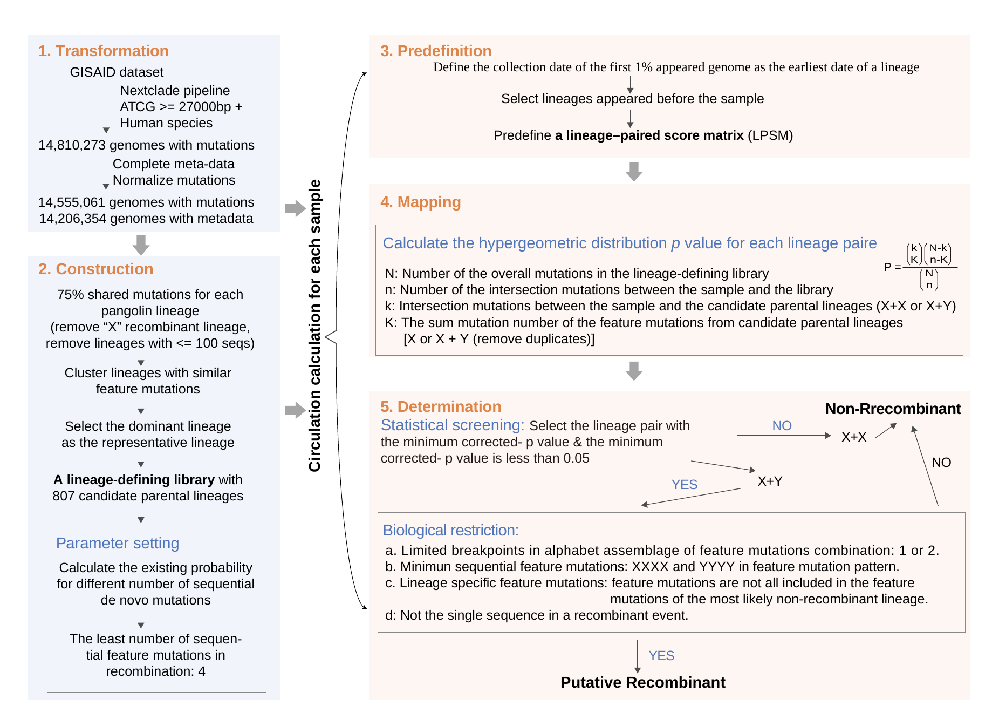

# CovRecomb-Global-Version
To identify the putative inter-lineage recombinants among global sequencing SARS-CoV-2 genomes.


## Overview
The co-circulation of multiple SARS-CoV-2 lineages and sub-lineages worldwide has provided a considerable background population for recombination events. However, the unprecedented accumulation of SARS-CoV-2 genomes also raised significant challenges for traditional recombination detection methods when aligning thousands of polymorphic sites.

Here, based on the hypergeometric-test-based algorithm, we developed an inter-lineage recombinant detection method named CovRecomb, which significantly decreases the computational cost because of its transformation from genomic comparison into the assignment of feature mutations.


## What is the CovRecomb-Global-Version?
The Global-Version is mainly designed for authors to update the global results of SARS-CoV-2 recombinants. Different from the CovRcomb-Local-Version, it takes account of the epidemiology data of the analyzing genomes, thus it could not only identify the possibility of recombination from the genomic information but also could distinguish the independent recombination events based on the global epidemiology background. In total, the CovRecomb-Global-Version provides a semi-automatic pipeline for authors to identify recombinants and detect recombination events.


## Requirements
  - python>=3.6
  - biopython>=1.70


## Workflow


### STEP 1: Transformation: transform the full genome to the mutational sites
- Date acquisition and filteration. 
- Exaction of mutations.
```
python fasta_clean_get_FM.py
python pos_norm.py
```

### STEP 2: Construction: construct the lineage-defining library
- Definition of feature mutations for each SARS-Cov-2 lineage.
- Cluster lineages with similar lineage-defining mutations.
- Parameter settings
```
python cluster_lineage.py
python least_number_of_FV.py
```

### STEP 3 & 4 & 5 
- Use the core algorithm of CovRecomb to identify inter-lineage recombinants.
- STEP 3: Predefinition: predefine a lineage-paired score matrix for each sample
- STEP 4: Mapping: map samples’ mutations against the predefined matrix
- STEP 5: Determination: determine the optimal lineage-paired combinations
```
python CovRecomb_pipeline.py
python confirm_epi_context.py
```

### STEP 6: Identification of independent recombination events
- Detect the independent recombination events from all the identified putative recombinants.
- Detect the linegae or variant paired patterns among the detected independent recombination events.
- Draw heatmap(s) for representing the lineage(and variant)-preference of recombination events.
```
python identify_patterns.py
Rscript paired_patterns.r
```

### STEP 7: Identification of the breakpoint distribution with the help of 3SEQ
- Detect the breakpoint distribution of the independent recombination events with the help of 3SEQ.

```
python identify_breakpoints.py 
```


## What is the Simulation-Test here?
A forward-evolution simulator called [CovSimulator](https://github.com/weigangq/cov-db/blob/master/scripts/CovSimulator.py) (Saymon Akther, 2021) was used to generate the simulation recombination dataset by considering the SARS-CoV-2 genome evolution and transmission. Based on the previous simulator, we made changes to meet the requirements of our simulation test. The simulation was divided into two stages: (1) the initial lineages generation process and (2) the lineage evolution process. In the first stage, starting from the SARS CoV-2 Wuhan strain, the genome would experience n times of generation (G) to generate 2^n^ sequences. Then we randomly sampled several sequences in the last generation and took them as the initial composition of viral lineages. In the second stage, apart from the similar evolution process as stage one, homologous inter-lineage and intra-lineage recombination would occur with a Poisson distributed rate of population size for each generation. We ensured that at least one inter-lineage recombinant and one intra-lineage recombinant occurred at each generation regardless of the population size. Notably, during each generation in the two stages, all genomes would mutate at random positions with the number of sites following the Poisson distribution. A preset proportion of sequences would share a preset number of homologous mutations, which help to integrate convergent evolution factor into the simulation.

To obtain a more realistic simulation of sample sequencing, two simulation conditions were carried out, including the ideal simulation and the analog simulation. The ideal simulation extracted all the generated sequences in each generation while the analog simulation randomly selected sequences in a preset proportion. The main difference between these two simulations is that the parental lineages of the extracted recombinants may not be sampled simultaneously in the analog simulation which is more like that of the real world. The missing parental lineages inevitably increased the difficulty for all recombinant detection methods, including CovRecomb and 3SEQ.


## Acknowledgements
We sincerely thank the Global Intiative on Sharing All Influenza Data ([GISAID](https://www.gisaid.org/)) and all data contributors for making SARS-CoV-2 genomic sequence data available to the public and open science. Besides, we would like to express our special thanks to the [CovSimulator](https://github.com/weigangq/cov-db/blob/master/scripts/CovSimulator.py) developers for their contributions in the field of simulation testing.