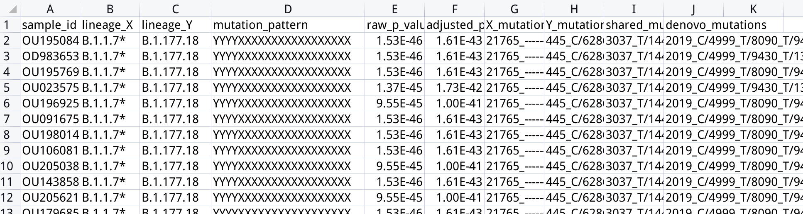

# CovRecomb-Local-Version
To identify the putative inter-lineage SARS-CoV-2 recombinants among consensus sequences inputted by users.


## What is the Local-Version?
The Local-Version enables users to deploy the core algorithm of CovRcomb on their local computer and to detect the putative recombinants among their customized datasets. Different from the CovRcomb-Global-Version, it takes no account of the epidemiology data of the uploaded genomes or the global epidemiology background, thus it could only analyze the possibility of recombination from the genomic information but could not distinguish the independent recombination events from the transmitted genomes as the Global-Version could. In total, the CovRecomb-Local-Version provides an automatic pipeline to detect the putative inter-lineage recombinants preliminarily.


## Requirements

### OS requirements:
The CovRecomb-Local-Version has been tested on the Linux: Ubuntu 20.04 system.

### Dependencies
  - python>=3.6
  - biopython>=1.70

### Python Dependencies
The CovRecomb-Local-Version mainly depends on the Python scientific stack.
```
argparse
pandas
Bio
multiprocessing
```

## Install 
You need to download the "CovRecomb-Local-Version" zip and use the command line below to install the CovRecomb-Local-Version.

```
cd CovRecomb-Local-Version
sudo python3 setup.py install
```

## Workflow

### Date filtration and mutations extraction

- Date acqusition and filtration: To guarantee the high quality of genomes and the integrity of epidemiological context, we drop out those sequences with low coverage (the overall length of A, T, C, and G bases is less than 27,000bp) in the inputted .fasta file.

- Extract the normalized mutations for each sequence: By trimed and mapped to the reference sequence, we extract mutations for each sequence and drop out those mutations locate in the start (1 - 265 nt) or the end (29,674 - 29,903 nt) untranslated region (UTR) regions.

### Get the lineage-defining feature mutations

- The lineage-defining feature mutaions (LDFM) file contains the representative lineages of SARS-CoV2 and their respective feature mutations.
It was presereved in the address 'CovRecomb/CovRecomb-Local-Version/defaults/LDFM_Feb11_2022.txt' and could be downloaded online.

### CovRecomb analysis

- Two dicts would be inputted into the CovRecomb analysis pipeline:

    (1) Feature mutations for each representative lineages.

    (2) Normalized mutations for each qualified sequences.

- During the analysis pipeline of CovRecomb, essential parametes are as follows:

    (1) The least number of sequencial feature mutations should be included in the feature mutation pattern of each candidate recombinant, the default number is 4.

    (2) The maximum number of breakpoint in the feature mutation pattern of each candidate recombinant, the default number is 2.

- Then, the putative recombinants with their corresponding parental lineages (X+Y) would be written in a '.csv' file.


## Basic Usage
Start with a .fasta file with sequence(s) that await for recombinants detection. All the sequences included in the file should have been aligned to a reference sequence and the reference sequence itself should also be included. The default genome is the Wuhan Hu-1 reference sequence, with its GenBank ID as MN908947.3 and the GISAID accession ID as EPI_ISL_402125. 

Put your customized file into the  "CovRecomb-Local-Version" folder, and then call:
```
CovRecomb <your_filename.fasta> -r <"genome name of your reference sequence">
```

### Example input
Here, we provide an example file in ```CovRecomb-Local-Version/sequence_aligned.fasta``` or ```CovRecomb-Local-Version/data/example_project/sequence_aligned.fasta```, you can use it to better understand the workflow by calling:
```
CovRecomb sequence_aligned.fasta -r "MN908947.3"
```

### Example running process


### Example output
The output files of the example analysis will be presented in ```CovRecomb-Local-Version/```, the example output file are already presented in ```CovRecomb-Local-Version/example_project/output_files/```.
- The first output file is "snp_norm.txt", the same as the ```CovRecomb-Local-Version/snp_norm_XA.txt``` file, which records the normalized mutations for each input sequence.

- The second output file is "putative_recombinants.csv", the same as the ```CovRecomb-Local-Version/putative_recombinants_XA.csv``` file, which records the identified putative recombinants and their corresponding parental lineages and feature mutation patterns.



## Advanced Usage
You can execute ```CovRecomb -h``` to get excactly this help message:
```
usage: CovRecomb <your_address_and_filename.fasta>

The local version of CovRecomb method to detect inter-lineage recombinants.

positional arguments:
  alignment             The filename of the input fasta file with aligned sequences, including the reference sequence.

optional arguments:
  -h, --help            show this help message and exit

  -f FILE_ADDRESS, --file_address FILE_ADDRESS
                        The address of the input file. Default: /CovRecomb-Local-Version/

  -b BREAKPOINT_NUMBER, --breakpoint_number BREAKPOINT_NUMBER
                        The maximum acceptable number of breakpoints among putative recombinants. Default: 2

  -r REFERENCE, --reference REFERENCE
                        The reference sequence ID, indicating which sequence in the alignment is the reference (by sequence ID). Default:
                        EPI_ISL_402125

  -t THRESHOLD, --threshold THRESHOLD
                        The least number of sequential feature mutations. Default: 4

  -o OUTPUT_FILE, --output_file OUTPUT_FILE
                        The filename of the output file with identified putative recombinants and their parental sequences. Default:
                        putative_recombinants.csv
                        
  -c CORE_NUMBER, --core_number CORE_NUMBER
                        The number of cores used while computation running. Default: 4
```


## Interpreting the output
- Two files belows would be output in the same folder of the above .fasta file.
- 1. A 'snp_norm.txt' file, recording the mutations for each inputted sequence. Those mutations located in the start (1 - 265 nt) or the end (29,674 - 29,903 nt) untranslated region (UTR) regions were excluded.
- 2. A '.csv' file, recording the identified results.It contains the putative recombinant's ID, the corresponding parental lineages and a feature mutation pattern represented by an alphabet assemblage of X and Y, such as “XXXXYYYYY”.


## Acknowledgements
We sincerely thank the Global Intiative on Sharing All Influenza Data ([GISAID](https://www.gisaid.org/)) and all data contributors for making SARS-CoV-2 genomic sequence data available to the public and open science.