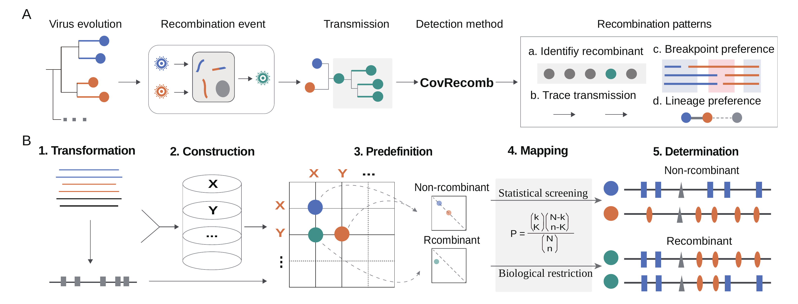

# CovRecomb
A method to detect the inter-lineage recombinant of SARS-CoV-2 genomes.

## Overview
The co-circulation of multiple SARS-CoV-2 lineages and sub-lineages worldwide has provided a considerable background population for recombination events. However, the unprecedented accumulation of SARS-CoV-2 genomes also raised significant challenges for traditional recombination detection methods when aligning thousands of polymorphic sites.

Here, based on the hypergeometric-test-based algorithm, we developed an inter-lineage recombinant detection method named CovRecomb, which significantly decreases the computational cost because of its transformation from genomic comparison into the assignment of feature mutations.

## Requirements
  - python>=3.6
  - biopython>=1.70

## CovRecomb-Global-Version
To identify the putative inter-lineage recombinants among global sequencing SARS-CoV-2 genomes.

The Global-Version is designed for authors to update the global results of SARS-CoV-2 recombinants. Different from the CovRcomb-Local-Version, it takes account of the epidemiology data of the analyzing genomes, thus it could not only identify the possibility of recombination from the genomic information but also could distinguish the independent recombination events based on the global epidemiology background. In total, the CovRecomb-Global-Version provides a semi-automatic pipeline for authors to identify recombinants and detect recombination events.

### Framework

### Implementation steps
Click the ([CovRecomb-Global-Version folder](https://github.com/wuaipinglab/CovRecomb/tree/main/CovRecomb-Global-Version)) to see the specific installation and use steps for the CovRecomb-Global-Version.

## CovRecomb-Local-Version
To identify the putative inter-lineage SARS-CoV-2 recombinants among consensus sequences inputted by users.

The Local-Version enables users to deploy the core algorithm of CovRcomb on their local computer and to detect the putative recombinants among their customized datasets. Different from the CovRcomb-Global-Version, it takes no account of the epidemiology data of the uploaded genomes or the global epidemiology background, thus it could only analyze the possibility of recombination from the genomic information but could not distinguish the independent recombination events from the transmitted genomes as the Global-Version could. In total, the CovRecomb-Local-Version provides an automatic pipeline to detect the putative inter-lineage recombinants preliminary.

### Implementation steps
Click the ([CovRecomb-Local-Version folder](https://github.com/wuaipinglab/CovRecomb/tree/main/CovRecomb-Local-Version)) to see the specific installation and use steps for the CovRecomb-Local-Version.

## Acknowledgements
We sincerely thank the Global Intiative on Sharing All Influenza Data ([GISAID](https://www.gisaid.org/)) and all data contributors for making SARS-CoV-2 genomic sequence data available to the public and open science.
